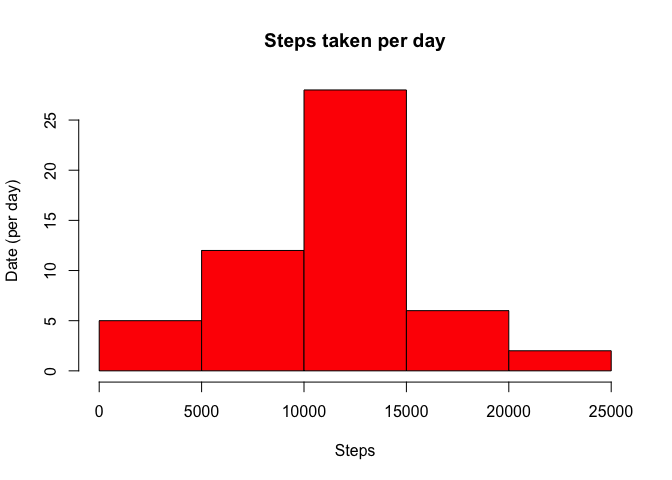
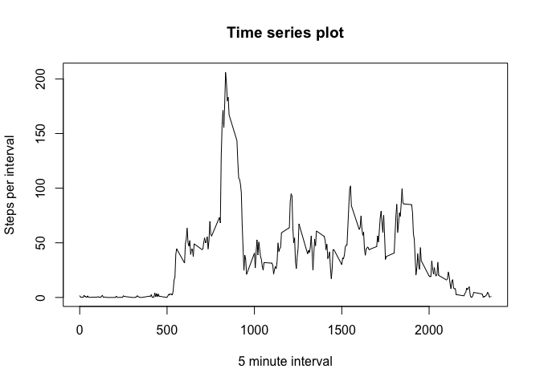
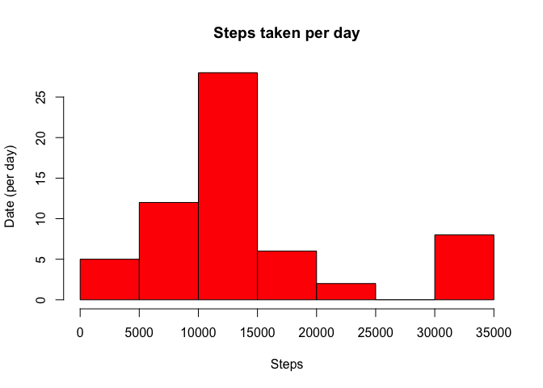
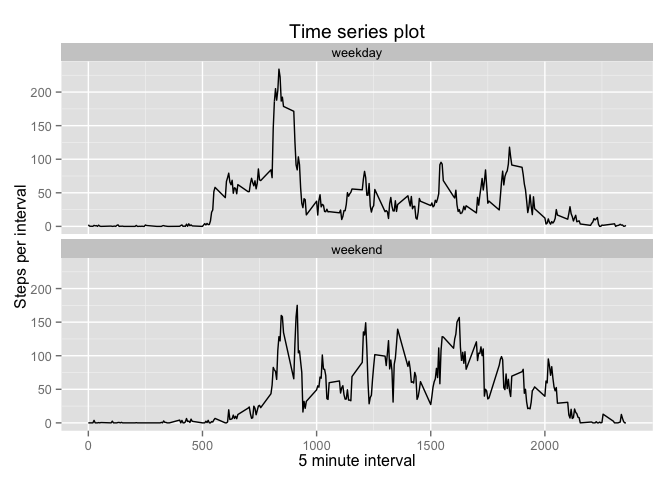

# Reproducible Research: Peer Assessment 1


## Loading and preprocessing the data

```r
downloadedZipFile = "activity.zip"
downloadedFile = "activity.csv"
downloadFolder = "tmp" 
if (!file.exists(downloadFolder)) {
      
    # create a tmp folder
    dir.create(downloadFolder)
    # unzip the file
    unzip(downloadedZipFile, exdir=downloadFolder)
}
activityData = read.csv(paste(downloadFolder, downloadedFile, sep = "/"), colClasses = c("numeric", "character", "numeric"))
## process data, if needed
activityDataTrimed = activityData[!is.na(activityData$steps),]
activityDataTrimed = transform(activityDataTrimed, date = as.Date(date, "%Y-%m-%d"))
head(activityDataTrimed)
```

```
##     steps       date interval
## 289     0 2012-10-02        0
## 290     0 2012-10-02        5
## 291     0 2012-10-02       10
## 292     0 2012-10-02       15
## 293     0 2012-10-02       20
## 294     0 2012-10-02       25
```


## What is mean total number of steps taken per day?

```r
#Calculate the total number of steps taken per day
totalSteps = aggregate(activityDataTrimed$steps ~ activityDataTrimed$date, FUN = sum)
colnames(totalSteps) = c("Date","Steps")
#If you do not understand the difference between a histogram and a barplot, research the difference between them. Make a histogram of the total number of steps taken each day

hist(totalSteps$Steps, col="red", 
      xlab = "Steps",
      ylab = "Date (per day)",
      main = "Steps taken per day"
       )
```

 

```r
#Calculate and report the mean and median of the total number of steps taken per day
mean(totalSteps$Steps)
```

```
## [1] 10766.19
```

```r
median(totalSteps$Steps)
```

```
## [1] 10765
```


## What is the average daily activity pattern?

```r
#Make a time series plot (i.e. type = "l") of the 5-minute interval (x-axis) and the average number of steps taken, averaged across all days (y-axis)
meanIntervalSteps = aggregate(activityDataTrimed$steps ~ activityDataTrimed$interval, FUN = mean)

plot(meanIntervalSteps,type = "l", xlab="5 minute interval", ylab="Steps per interval", main="Time series plot")
```

 

```r
#Which 5-minute interval, on average across all the days in the dataset, contains the maximum number of steps?
meanIntervalSteps[which.max(meanIntervalSteps$`activityDataTrimed$steps`),]
```

```
##     activityDataTrimed$interval activityDataTrimed$steps
## 104                         835                 206.1698
```


## Imputing missing values


```r
#Calculate and report the total number of missing values in the dataset (i.e. the total number of rows with NAs)
nrow(activityData[is.na(activityData$steps),])
```

```
## [1] 2304
```

```r
#Devise a strategy for filling in all of the missing values in the dataset. The strategy does not need to be sophisticated. For example, you could use the mean/median for that day, or the mean for that 5-minute interval, etc.
activityDataNoNA = activityData
activityDataNoNA = transform(activityDataNoNA, date = as.Date(date, "%Y-%m-%d"))
for(i in 1:length(activityDataNoNA$steps)) {
  if (is.na(activityDataNoNA$steps[i])) {
    
    sumDate = as.numeric(format(activityDataNoNA$date[i], "%m")) + as.numeric(format(activityDataNoNA$date[i], "%d"))
    #print(sumDate)
    #activityDataNoNA$steps[i] = round(mean(activityDataNoNA$interval[i]+sumDate) %/% activityDataNoNA$interval[i])
    activityDataNoNA$steps[i] = round(median(activityDataNoNA$interval[i]+sumDate) %/% 10)
  }
}
#print(head(activityDataNoNA))
#Create a new dataset that is equal to the original dataset but with the missing data filled in.
nrow(activityDataNoNA[is.na(activityDataNoNA$steps),]  )
```

```
## [1] 0
```

```r
#Make a histogram of the total number of steps taken each day and Calculate and report the mean and median total number of steps taken per day. Do these values differ from the estimates from the first part of the assignment? What is the impact of imputing missing data on the estimates of the total daily number of steps?
totalStepsNoNa = aggregate(activityDataNoNA$steps ~ activityDataNoNA$date, FUN = sum)
colnames(totalStepsNoNa) = c("Date","Steps")
hist(totalStepsNoNa$Steps, col="red", 
      xlab = "Steps",
      ylab = "Date (per day)",
      main = "Steps taken per day"
       )
```

 

```r
mean(totalStepsNoNa$Steps)
```

```
## [1] 13865.44
```

```r
median(totalStepsNoNa$Steps)
```

```
## [1] 11458
```


## Are there differences in activity patterns between weekdays and weekends?


```r
#Create a new factor variable in the dataset with two levels – “weekday” and “weekend” indicating whether a given date is a weekday or weekend day.
#activityDataTrimed$day_type = weekdays(activityDataTrimed$date)
activityDataTrimed$daytype = "weekday"
for(i in 1:length(activityDataTrimed$date)) {
  if (!is.na(activityDataTrimed$date[i])) {
    
    day = weekdays(activityDataTrimed$date[i])
    #print(day)
    if ((day == "Saturday") || (day == "Sunday")) {
      activityDataTrimed$daytype[i] = "weekend"
    }
    #else {
    #  activityDataTrimed$daytype[i] = "weekday"
    #}
  }
}
#head(activityDataTrimed)
activityDataTrimed$daytype = as.factor(activityDataTrimed$daytype)

#Make a panel plot containing a time series plot (i.e. type = "l") of the 5-minute interval (x-axis) and the average number of steps taken, averaged across all weekday days or weekend days (y-axis). See the README file in the GitHub repository to see an example of what this plot should look like using simulated data.
meanWeekIntervalSteps = aggregate(activityDataTrimed$steps ~ activityDataTrimed$interval+activityDataTrimed$daytype, FUN = mean)
colnames(meanWeekIntervalSteps) = c("interval","daytype","steps")
library(ggplot2)
qplot(interval, steps,data=meanWeekIntervalSteps,type = "l", xlab="5 minute interval", ylab="Steps per interval", main="Time series plot", geom=c("line")) + facet_wrap(~ daytype, ncol=1)
```

 

###clean the workspace

```r
rm(activityData, activityDataTrimed, totalSteps, meanIntervalSteps, activityDataNoNA, totalStepsNoNa, meanWeekIntervalSteps)
if (file.exists(downloadFolder)) {
    #print("deleting tmp folder")
    unlink(downloadFolder, recursive = TRUE)
  }
```
